# Secure Private Infrastructure Deployment with Bastion Access and IAM Role-Based Architecture

## 📌 Project Overview
This project demonstrates a secure AWS architecture where:
- Application servers run in private subnets
- No public IP is assigned to backend servers
- Access is controlled via a Bastion Host
- IAM Roles are used instead of static credentials

---

## ⚙️ Tech Stack
- AWS EC2
- AWS VPC
- AWS IAM
- AWS S3
- NAT Gateway
- Internet Gateway
- Nginx

---

## 🔐 Architecture Flow
Local Machine → Bastion Host → Private EC2 → IAM Role → S3

---

## 📸 Screenshots

### 1. Architecture Overview
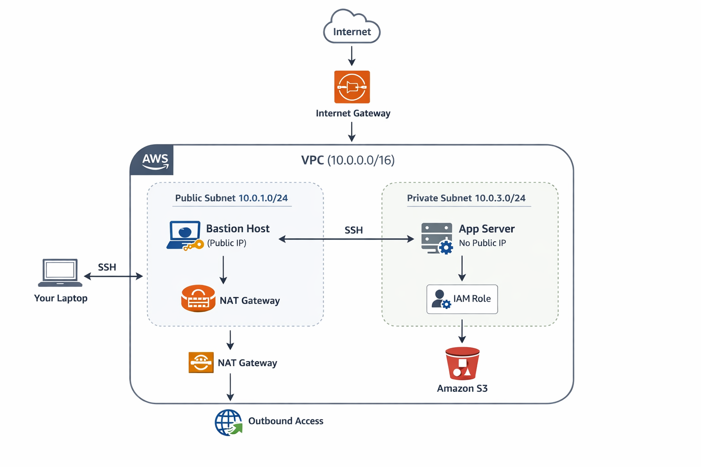

### 2. EC2 Instances
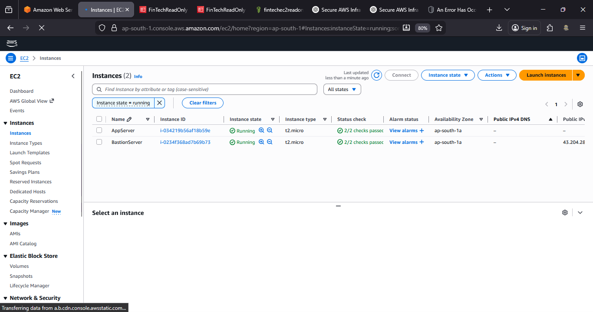

### 3. Public Subnets Configuration
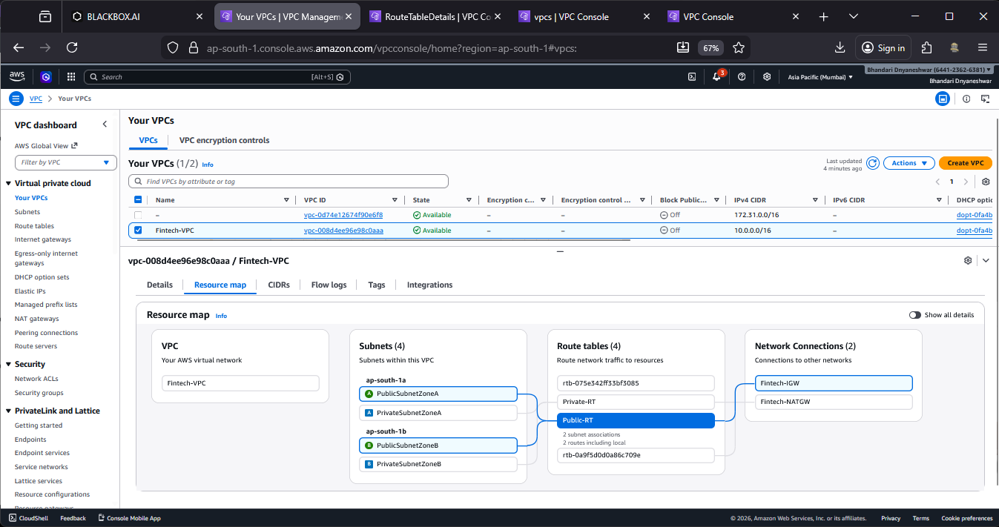

### 4. Private Subnets Configuration
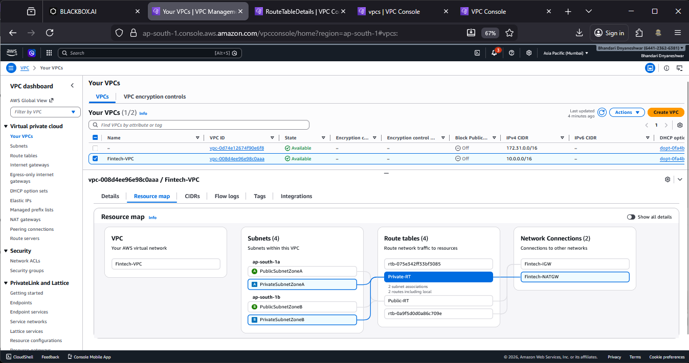

### 5. Bastion Security Group
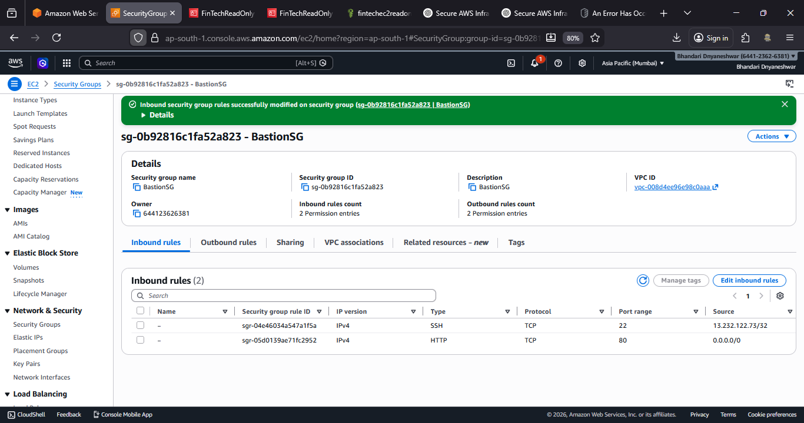

### 6. Application Server Security Group
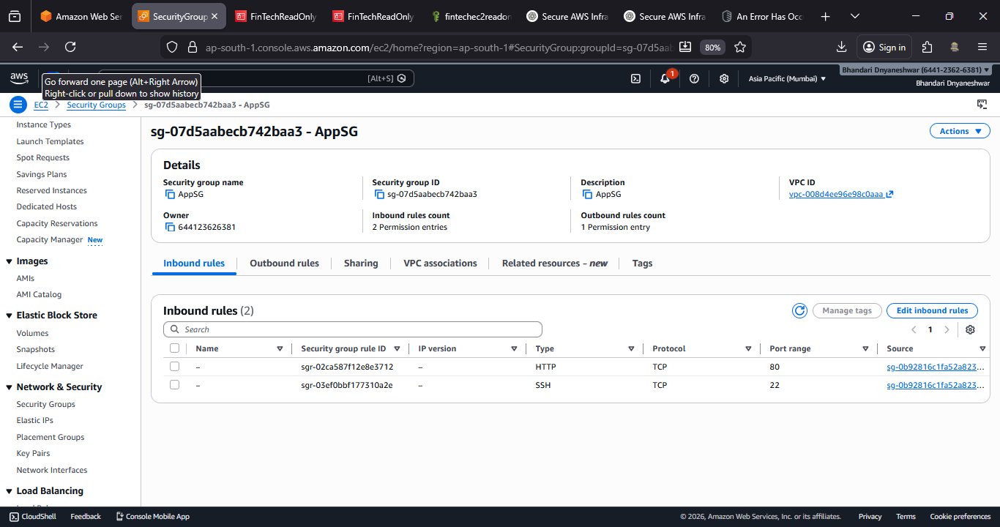

### 7. Bastion SSH Access
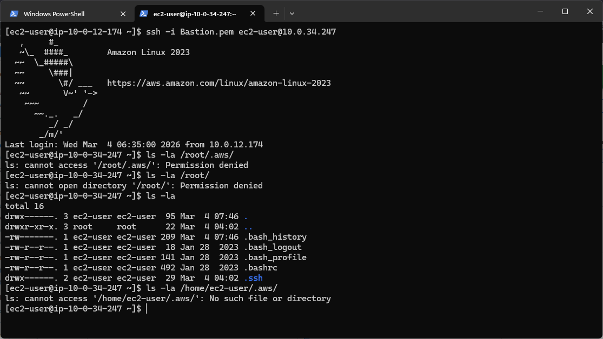

### 8. Private Server SSH Access via Bastion
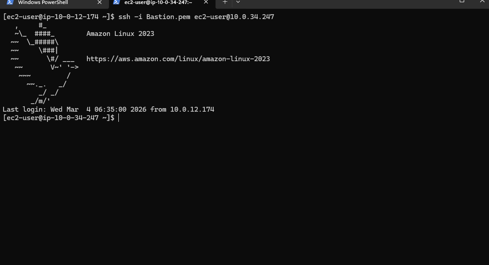

### 9. Application Server Setup
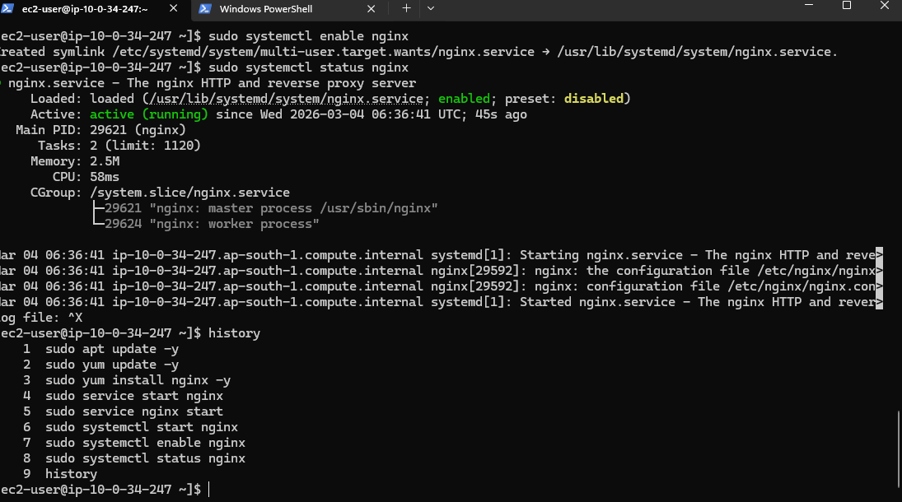

### 10. Application Server External Access
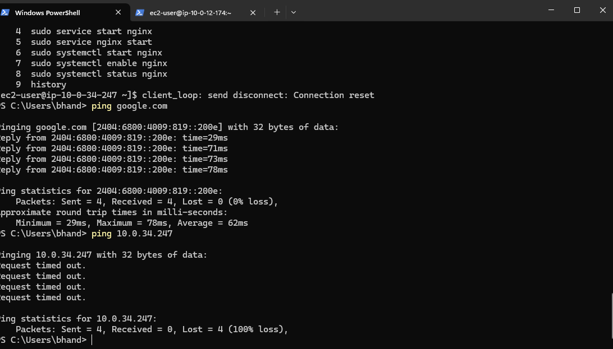

### 11. IAM Role Configuration
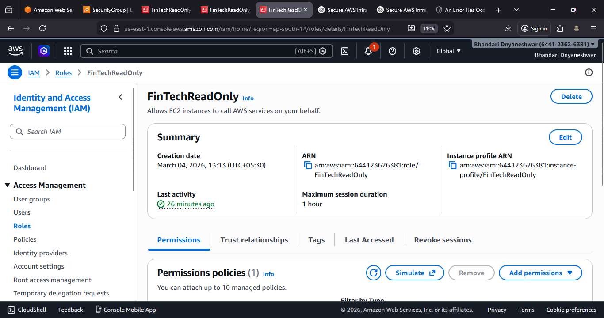

### 12. IAM Role Modification
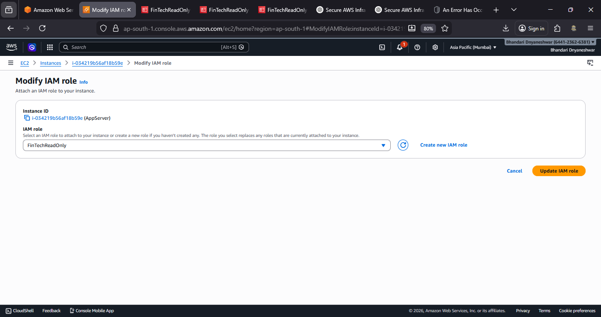

### 13. S3 Bucket
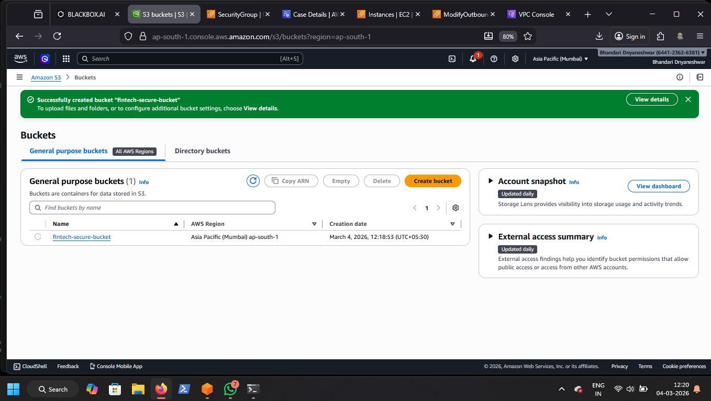

### 14. S3 Access Verification
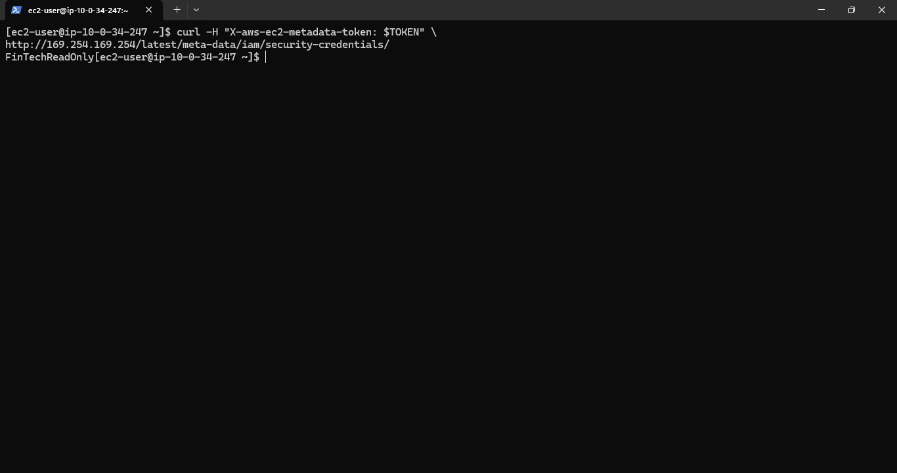

---

## 🧪 Verification

### S3 Access
```bash
aws s3 ls s3://fintech-secure-bucket
```

### SSH Flow
```bash
ssh -i key.pem ec2-user@bastion-ip
ssh -i key.pem ec2-user@private-ip
```

---

## 🔐 Security Highlights
- ✅ Private subnet isolation for application servers
- ✅ Bastion host as single entry point
- ✅ IAM role-based authentication (no static credentials)
- ✅ Security groups with least privilege access
- ✅ No public IP addresses on backend servers
- ✅ Secure SSH tunneling through bastion

---

## 🚀 Key Features
- **Secure Network Architecture**: VPC with public and private subnets
- **Bastion Host**: Controlled access point to private infrastructure
- **IAM Roles**: Temporary credentials instead of access keys
- **S3 Integration**: Secure bucket access via IAM roles
- **Production-Ready**: Suitable for fintech and compliance-heavy environments

---

## 📁 Project Structure
```
bastion-project/
 ├── README.md                    # Project documentation
 ├── documentation.pdf            # Detailed implementation guide
 ├── architecture.png             # High-level architecture diagram
 └── screenshots/                 # Implementation screenshots
   
```
